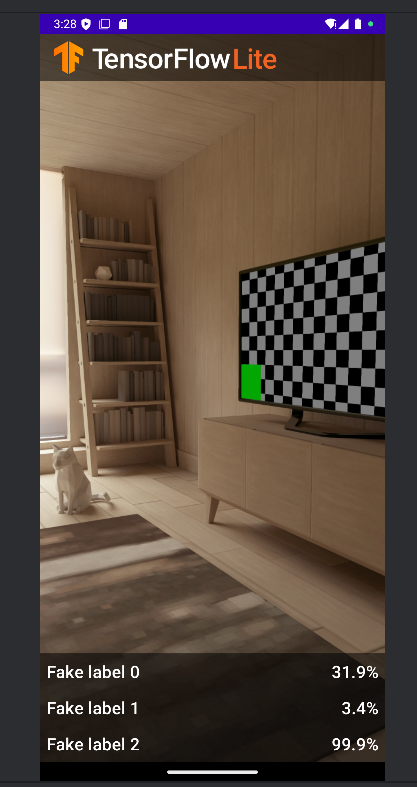
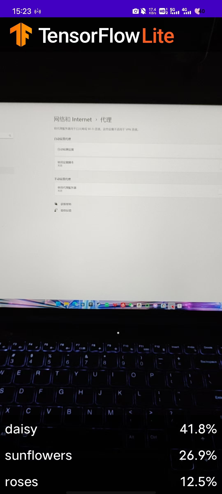

基于TensorFlow Lite实现的Android花卉识别应用

## 运行初始代码

1.打开Android Studio，选择“Open an Existing Project”

2.选择TFLClassify/build.gradle生成整个项目。项目包含两个module：finish 和 start，finish模块是已经完成的项目，start则是本项目实践的模块。

3.第一次编译项目时，弹出“Gradle Sync”，将下载相应的gradle wrapper 。

4.手机通过USB接口连接开发平台，并设置手机开发者选项允许调试。

5.选择真实物理机（而不是模拟器）运行start模块

6.允许应用获取手机摄像头的权限，得到下述效果图，界面利用随机数表示虚拟的识别结果。（这是模拟器运行的结果）



## 向应用中添加TensorFlow Lite

1.选择"start"模块

2.右键“start”模块，或者选择File，然后New>Other>TensorFlow Lite Model

3.选择已经下载的自定义的训练模型。本教程模型训练任务以后完成，这里选择finish模块中ml文件下的FlowerModel.tflite。点击“Finish”完成模型导入，系统将自动下载模型的依赖包并将依赖项添加至模块的build.gradle文件。

4.最终TensorFlow Lite模型被成功导入，并生成摘要信息

## 检查代码中的TODO项

本项目初始代码中包括了若干的TODO项，以导航项目中未完成之处。为了方便起见，首先查看TODO列表视图，View>Tool Windows>TODO，默认情况下了列出项目所有的TODO项，进一步按照模块分组（Group By）

## 添加代码重新运行APP

1.定位“start”模块**MainActivity.kt**文件的TODO 1，添加初始化训练模型的代码

```
 private class ImageAnalyzer(ctx: Context, private val listener: RecognitionListener) :
        ImageAnalysis.Analyzer {

  ...
  // TODO 1: Add class variable TensorFlow Lite Model
  private val flowerModel = FlowerModel.newInstance(ctx)

  ...
}

```

2.在CameraX的analyze方法内部，需要将摄像头的输入`ImageProxy`转化为`Bitmap`对象，并进一步转化为`TensorImage` 对象

```
override fun analyze(imageProxy: ImageProxy) {
  ...
  // TODO 2: Convert Image to Bitmap then to TensorImage
  val tfImage = TensorImage.fromBitmap(toBitmap(imageProxy))
  ...
}

```

3.对图像进行处理并生成结果，主要包含下述操作：

- 按照属性`score`对识别结果按照概率从高到低排序
- 列出最高k种可能的结果，k的结果由常量`MAX_RESULT_DISPLAY`定义

```
override fun analyze(imageProxy: ImageProxy) {
  ...
  // TODO 3: Process the image using the trained model, sort and pick out the top results
  val outputs = flowerModel.process(tfImage)
      .probabilityAsCategoryList.apply {
          sortByDescending { it.score } // Sort with highest confidence first
      }.take(MAX_RESULT_DISPLAY) // take the top results

  ...
}

```

4.将识别的结果加入数据对象`Recognition` 中，包含`label`和`score`两个元素。后续将用于`RecyclerView`的数据显示

```
override fun analyze(imageProxy: ImageProxy) {
  ...
  // TODO 4: Converting the top probability items into a list of recognitions
  for (output in outputs) {
      items.add(Recognition(output.label, output.score))
  }
  ...
}

```

5.将原先用于虚拟显示识别结果的代码注释掉或者删除

```
// START - Placeholder code at the start of the codelab. Comment this block of code out.
for (i in 0..MAX_RESULT_DISPLAY-1){
    items.add(Recognition("Fake label $i", Random.nextFloat()))
}
// END - Placeholder code at the start of the codelab. Comment this block of code out.

```

6.以物理设备重新运行start模块

7.最终运行效果


